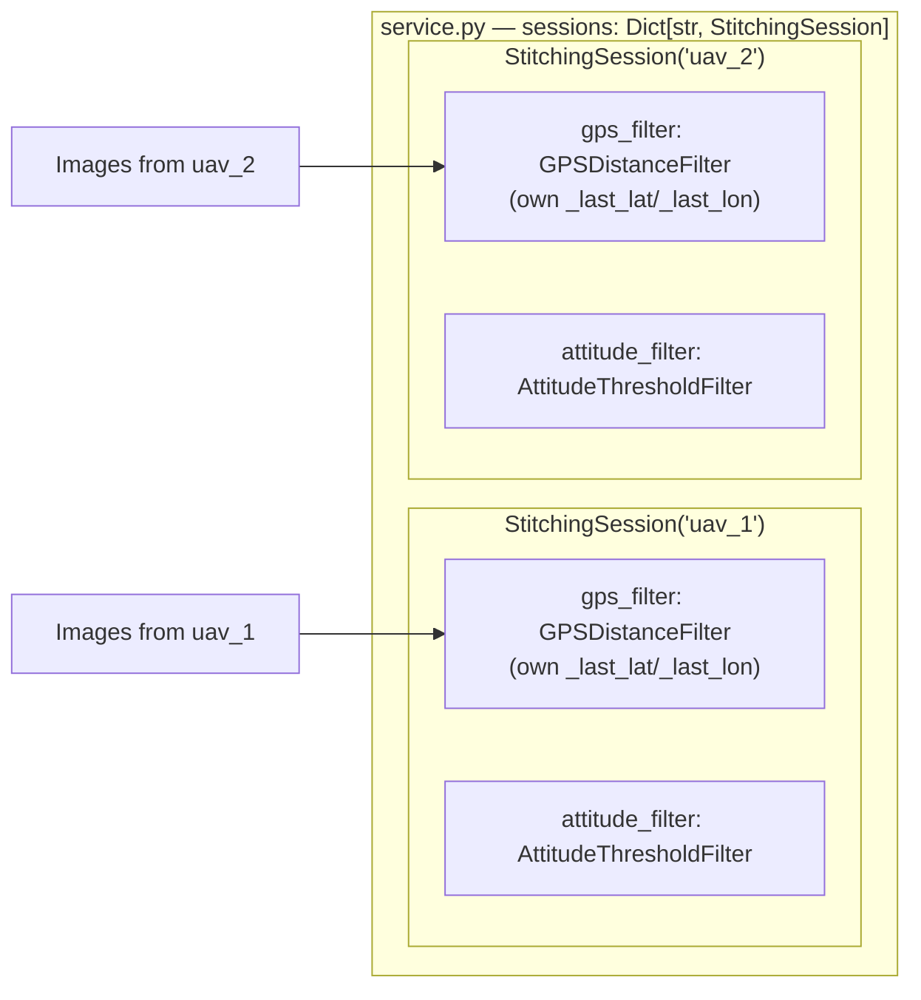

# Composable Orchestrator Module — Design

> **Status**: Design agreed, not yet implemented.
> **Scope**: Items 1-3 only — attitude-aware EXIF/`dataMatrix` extraction, GPS-distance filter, attitude-threshold filter. OpenCV-Stitcher fallback (originally item 4) dropped from scope — its output isn't georeferenced, which silently breaks any GPS-based overlay downstream (see chat discussion, same day).
> **Lives in**: `src/flight_metadata.py` (new file), so it rides along automatically when `src/` gets copied into the GCS backend's `stitching_service/src/`.
> **Consumed by**: `service.py` first (local simulation harness, this repo), later `app/routers/stitching.py` (GCS production) once validated.

---

## 1. Pipeline Flow (single session)

```mermaid
flowchart TD
    A["New image file arrives\n(receiver_socket.py writes to\nsessions/{id}/images/)"] --> B["Watchdog on_created\n(service.py)"]
    B --> C["extract_flight_metadata(path)\nsrc/flight_metadata.py"]
    C --> D{"EXIF GPS + attitude\npresent?"}

    D -- "yes" --> E["Gate 1: AttitudeThresholdFilter\n.should_accept(roll, pitch)"]
    E -- "fails (too tilted)" --> R1["Reject — not counted,\nnot stitched"]
    E -- "passes" --> F["Gate 2: GPSDistanceFilter\n.should_accept(lat, lon)"]
    F -- "fails (too close to last)" --> R2["Reject — redundant,\nnot stitched"]
    F -- "passes" --> G["Accepted:\nreal pose in degrees,\nhas_telemetry = True"]

    D -- "no" --> H["Fallback path\n(no gating possible)"]
    H --> I["pose = [0,0,0, 0,0,0]\nhas_telemetry = False\n(NOT fabricated GPS)"]
    I --> J["Accepted, but flagged\ndegraded-confidence"]

    G --> K["Appended to session's\naccepted image + metadata list"]
    J --> K

    K --> L{"accepted count >=\nauto_stitch_threshold?"}
    L -- "no" --> M["Wait for more images"]
    L -- "yes" --> N["build_data_matrix(accepted_metadata)\nsrc/flight_metadata.py"]
    N --> O["Combiner.Combiner(images, data_matrix)\n.create_mosaic()"]
    O --> P["Mosaic written to\nsessions/{id}/output/"]

    style H fill:#4a2020,stroke:#a04040
    style I fill:#4a2020,stroke:#a04040
    style J fill:#4a3020,stroke:#a08040
```

**Key point visible in the diagram**: the fallback path (red) still reaches "Accepted" — it does not reject the frame — but it carries `has_telemetry = False` all the way to `build_data_matrix()`, so the *future* Combiner GPS-sanity-check work (separate, not part of this module) can recognize and skip validation for it instead of misreading a placeholder zero as a real, implausible position jump.

---

## 2. Per-Session Filter Isolation

Addressing the blind spot from earlier discussion — filters are **not global**, they live on the session object:

Each session instantiates its own filter pair at `StitchingSession.__init__` time — same pattern as `self.image_folder`, not a module-level singleton. Without this, `uav_2`'s incoming frame would get its GPS distance compared against `uav_1`'s last accepted position — two different flights, nonsense result.

---

## 3. Components (`src/flight_metadata.py`)

| Name | Kind | Responsibility |
|---|---|---|
| `extract_flight_metadata(img_path)` | function | Read EXIF: GPS lat/lon/alt (GPS IFD), yaw (`GPSImgDirection`), roll/pitch (`ImageDescription` JSON). Returns degrees throughout — **no radian conversion** (that's `geometry.computeUnRotMatrix`'s job). Returns `has_telemetry: False` + zero pose if EXIF absent, instead of fabricating GPS. |
| `build_data_matrix(metadata_list, origin=None)` | function | Consolidates the GPS→local-meters math currently duplicated in `service.py` and the GCS router. Fills columns 0-2 (X/Y/Z) and, newly, 3-5 (Yaw/Pitch/Roll) — the columns every existing caller leaves at zero today. |
| `GPSDistanceFilter` | class, stateful | Haversine-based redundancy filter, ported from `stitcher.py`'s `GPSThresholdFilter`. One instance per session. |
| `AttitudeThresholdFilter` | class, stateful | Tilt-based quality gate, ported from `stitcher.py`. One instance per session. Checked **before** the GPS filter (preserves `stitcher.py`'s deliberate ordering — see §4 discussion, same day: swapping order would let a rejected-for-tilt frame still mutate the GPS filter's reference position). |

---

## 4. Open Decision Recorded

**EXIF-missing fallback**: stitch directly using a zero-pose row (`has_telemetry = False`) rather than fabricating incrementing dummy GPS (`stitcher.py`'s current approach) or rejecting the frame outright. Chosen because it reuses the already-proven stock "image-only mode" code path with zero new Combiner logic, keeps corridor coverage continuous, and avoids injecting fictitious position data that could poison a future GPS-based sanity check. Trade-off accepted: that frame gets zero quality gating (no GPS-distance or attitude check possible) and slightly higher mis-registration risk (same risk stock image-only mode already carries everywhere) — mitigate by surfacing a visible "degraded confidence" flag to the operator (e.g. WebSocket event), not by silently blending it in.

---

## 5. Testing Plan

1. Unit-test `extract_flight_metadata()` directly against a few of the colleague's known-good captured images (real EXIF, from the dataset that produced the diagonal-skewed orthomosaic) — sanity-check output against a manual EXIF read.
2. Unit-test `geometry.computeUnRotMatrix()` with a known degree pose (e.g. `[0,0,0, 0,15,0]`) — confirm the returned matrix reflects a real 15° correction, not ~57× too small (`BUG_REPORT_ATTITUDE_UNIT_MISMATCH.md` §4.5, item 1).
3. Full pipeline: `sender_socket_sim.py` (pointed at the colleague's known dataset) → `receiver_socket.py` → modified `service.py` → compare resulting mosaic against the known diagonal-skewed one. **Expected**: whole-mosaic rotational skew reduced/gone; the single-frame ghosting/mismatch artifact likely still present (separate root cause, `Combiner.py` fix not part of this module — confirmed expectation, same day).
4. Isolated filter tests: confirm `GPSDistanceFilter` rejects near-duplicate positions and `AttitudeThresholdFilter` rejects over-tilted frames, independent of the full pipeline.
5. Fallback-path test: feed an image with no EXIF at all through the pipeline, confirm it's accepted with `has_telemetry = False`, zero pose, and does not fabricate a GPS position.

---

*Related reading: [BUG_REPORT_ATTITUDE_UNIT_MISMATCH.md](./BUG_REPORT_ATTITUDE_UNIT_MISMATCH.md), [DRIFT_MISREGISTRATION.md](./DRIFT_MISREGISTRATION.md), [gcs_docs.md](./gcs_docs.md) §4 (target production integration point).*
