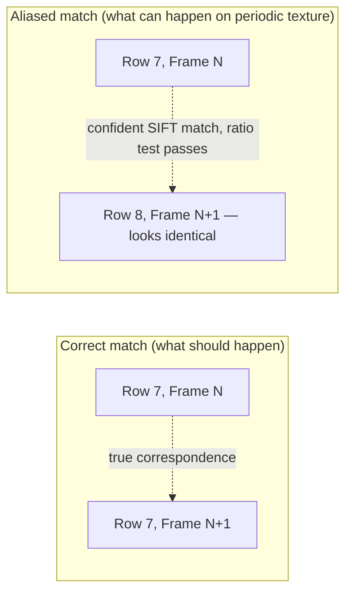

# Investigation: Frame Misregistration on Repetitive Texture (Farmland Corridor)

> **Status**: Hypothesis, not yet confirmed against a captured failure case.
> **Affects**: `src/Combiner.py` — `combine()` pipeline (feature matching → transform estimation → chaining).
> **Reported by**: Colleague's fork of the stitching service, tested on a farmland corridor mission (straight-line hover over roads + crop fields).

---

## 1. The Problem, Restated

During a straight-line corridor flight over farmland, the mosaic stitched correctly for a number of frames, then — at an unpredictable point, not a fixed frame count — one new frame was **not placed adjacent to the previous frame** as expected. Instead, it landed **almost exactly on top of** the already-stitched previous frame, producing a visible ghosting/overlap artifact in an otherwise clean mosaic.

Important details that shape the diagnosis:

| Observation | Why it matters |
|---|---|
| Happens at **random intervals**, not every 50–100 frames | Rules out the well-known *cumulative drift* failure mode (§10.1 in [TECHNICAL.md](./TECHNICAL.md)), which is gradual and scales with frame count. This looks like a **single-frame misregistration event**, not accumulated error. |
| The bad frame still **has valid, matchable keypoints** — matching didn't fail, it succeeded "confidently" on the wrong correspondence | Rules out "not enough features" or "no overlap" failures (those are caught explicitly at `Combiner.py:258` and would skip the frame, not misplace it). |
| Terrain at the time was **farmland — roads and repeating crop/yield rows** | This is the strongest clue. See §3. |
| Drone flight is a **straight lane**, so real frame-to-frame motion should be a small, consistent forward translation | Makes it possible to reason about what a "wrong but plausible" transform looks like. |
| IMU on the drone is used only as a **pre-capture filter** (reject frames with roll/pitch > 15–20°) | Onboard gating is real and correct. But whether `dataMatrix`'s Yaw/Pitch/Roll columns actually do anything useful once they reach `Combiner` is a separate question — see [BUG_REPORT_ATTITUDE_UNIT_MISMATCH.md](./BUG_REPORT_ATTITUDE_UNIT_MISMATCH.md): in the colleague's fork these columns aren't zero, but a degrees/radians double-conversion bug scales them down ~57×, so the rotation correction they're meant to drive is still effectively disabled — just via a different mechanism than "always 0." |
| GPS **is** being computed into local X, Y, Z (`data_matrix[i, 0:3]`) in the colleague's fork | This data exists but currently goes nowhere useful — see §4. |
| ROI adaptive prediction is active, unmodified | Doesn't prevent the issue — see §5. |

---

## 2. What Actually Happens in Code (confirmed by reading `src/Combiner.py`)

Walking `combine(index)` step by step:

1. **ROI prediction** (`__predict_roi`, line 128) narrows the search window for the incoming frame based on `H_rel_prev` — purely visual, no GPS involved.
2. **Feature detection** (`__detect_features`, line 72): SIFT, up to 1800 keypoints, inside that ROI.
3. **Feature matching** (`__match_features`, line 80): `BFMatcher.knnMatch(k=2)` + Lowe's ratio test at `0.55`.
4. **Guard**: `if len(matches) < 4: skip` (line 258) — **the only quality gate that exists**. It checks quantity, never quality.
5. **Transform estimation** (`__estimate_transform`, line 91): `cv2.estimateAffinePartial2D(src_pts, dst_pts)`. This call *internally* runs RANSAC and returns an inlier mask — but the code discards it: `A, _ = cv2.estimateAffinePartial2D(...)` (line 100). There is no check of how many of the ≥4 matches were actual inliers, no residual/reprojection-error check, no check that the matched points spatially spread across the frame rather than clustering in one small repetitive patch.
6. **Chaining** (line 279–284): whatever `H_rel` came out of step 5 — good or corrupted — is immediately trusted and multiplied into `H_global_prev`, and also stored as `H_rel_prev` for the *next* frame's ROI prediction.
7. **Warp + blend**: the frame is pasted wherever that (possibly wrong) matrix says.

**There is no point in this pipeline where a transform can be rejected for being geometrically implausible.** Once ≥4 ratio-test-passing matches exist, whatever affine/homography comes out is accepted unconditionally.

---

## 3. Hypothesis: SIFT Descriptor Aliasing on Periodic Texture

This is the part that's easiest to misread as "not enough distinct features," so here's the intuition in plain terms.

Crop rows / furrows / yield-field patterns repeat at a roughly constant spatial period. A SIFT descriptor summarizes the local gradient pattern around a keypoint — and **a patch of crop-row #7 looks almost identical to a patch of crop-row #8, #9, etc.**, because the local texture repeats.

Lowe's ratio test (`m.distance < 0.55 * n.distance`) is designed to reject *ambiguous* matches — cases where the best and second-best candidate are nearly equally good, meaning the algorithm can't tell them apart. But on periodic texture, this protection can fail in a specific way:

- If the frame's actual forward displacement happens to be close to a multiple of the crop row's spacing (in the current image scale), then **the true corresponding row and a neighboring, wrong row can both look highly distinctive relative to everything else in the scene** — just not distinctive *from each other*. The best match might come out clearly ahead of the second-best (passing the ratio test with confidence) while still being the wrong row.
- Once enough of these "confidently wrong" correspondences exist (only 4 are needed — see §2, step 4), `estimateAffinePartial2D`'s internal RANSAC will happily fit a consistent-looking affine to them, because they *agree with each other* (they're all off by the same row-period), even though they disagree with ground truth.



Depending on which way the aliasing goes, the resulting `H_rel` can come out as:
- **Near-identity** (matched row treated as "the same row, no motion") → new frame warps almost exactly on top of the previous one. **This matches your description exactly.**
- Or an integer multiple of the true per-frame translation (matched one row too far) → visible jump/skip instead of overlap.

This also explains the **"random interval"** pattern: this isn't a systemic bias that fires every frame or every N frames — it's a coincidence between (a) the current field's row spacing, (b) the drone's actual per-frame ground displacement (which drifts with speed, altitude, and capture timing), and (c) which specific keypoints SIFT happens to pick that frame. It will only misfire when those happen to line up.

---

## 4. The Overlooked Fix: GPS Data Is Already Being Computed, But Never Used to Sanity-Check Anything

Your colleague's fork already converts GPS to local metric coordinates:

```python
data_matrix[i, 0] = x   # local X (meters), from lon
data_matrix[i, 1] = y   # local Y (meters), from lat
data_matrix[i, 2] = alt
```

But tracing where `dataMatrix` is read inside `Combiner`, it is used **exactly once** — inside `computeUnRotMatrix` (`src/geometry.py`), for the rotation-correction step during preprocessing. Since Yaw/Pitch/Roll are always 0 (IMU never reaches this far, per your description), that call effectively does nothing.

**Nothing in `combine()` ever looks at `dataMatrix[index-1]` vs `dataMatrix[index]` to ask "does the visually-estimated motion roughly agree with the GPS-implied motion?"** This is precisely the gap TECHNICAL.md §10.1 and §10.3 call out as future work — and it happens to be the natural fix for this exact bug, because the data is already sitting there, computed, unused.

---

## 5. Why Adaptive ROI Prediction Doesn't Save You Here

To directly answer "did I miss something proposing ROI prediction?" — no, ROI prediction is doing its job (reducing search space based on expected overlap). It's just **solving a different problem** (compute cost, false-matching against *distant* background) than the one you're hitting here (near-field aliasing between visually-identical repeating structures). Two additional wrinkles:

1. ROI narrows the crop *before* detecting keypoints. If the true corresponding row and its aliasing neighbors are all inside that crop, narrowing the box doesn't remove the ambiguity — it can *reduce* the number of unique, non-repeating anchor features (like a road edge or tree line at the image border) that would otherwise help disambiguate, since the 15% padding margin may not reach them.
2. ROI prediction for frame `N+1` depends on `H_rel_prev` from frame `N`. If frame `N`'s `H_rel` was corrupted by aliasing, frame `N+1`'s ROI is now predicted from a wrong assumption — the error has a (limited) chance to propagate into the next step too, rather than self-correcting.

---

## 6. Candidate Solutions & Trade-offs

| # | Approach | Mechanism | Effort | Trade-offs |
|---|---|---|---|---|
| 1 | **GPS translation sanity check** (recommended first step) | Compute expected translation from `dataMatrix[index-1] → dataMatrix[index]` (already-available local X/Y delta). Compare against the translation component of the candidate `H_rel`. If divergence exceeds a tolerance, reject the transform. | Low — data already computed, just needs a comparison + fallback branch in `combine()`. | Needs a sensible tolerance (depends on GPS accuracy, ~1–3m typical consumer GNSS — may need slack). Doesn't fix the underlying mismatch, just catches it. Requires a defined fallback behavior (see row 6). |
| 2 | **Use the RANSAC inlier mask** currently discarded at `Combiner.py:100` | Require a minimum inlier *ratio* (e.g., ≥60–70% of matches must be inliers), not just a minimum raw count of 4. | Low — one-line change to capture the mask, plus a ratio check. | Doesn't catch the aliasing case where *all* aliased matches agree with each other (they'll all look like "inliers" to RANSAC, since RANSAC only checks self-consistency, not ground truth). Still worth doing — it's a free, cheap guard against a different (unrelated) failure mode: too-few/degenerate matches. |
| 3 | **Spatial spread check on matched keypoints** | Reject a transform if the matched points cluster in a small region rather than spreading across the frame (e.g., bounding box of matched points must cover some minimum % of image width/height). | Low–Medium | Aliased periodic-texture matches often *do* spread out (the whole field is periodic), so this check alone may not catch this specific case — better paired with #1. |
| 4 | **Minimum plausible translation magnitude** | Reject `H_rel` if its translation is suspiciously close to zero while GPS says the drone moved a non-trivial distance. | Low | This is really a specific case of #1 — same data requirement, narrower check. Cheap complement, not a replacement. |
| 5 | **Keyframe re-anchoring** (already flagged in TECHNICAL.md §10.1) | Every K frames, match against a stored keyframe instead of only the immediate predecessor, so an isolated bad match doesn't permanently corrupt the chain. | Medium | Helps *cumulative* drift more than it helps this specific single-frame misregistration — a bad match against the keyframe is exactly as vulnerable to aliasing as a bad match against `N-1`. Complementary, not a fix for this bug specifically. |
| 6 | **Fallback strategy when a transform is rejected** (needed regardless of which detection method above is chosen) | Options: (a) retry matching using the full frame instead of the ROI crop, hoping non-repeating anchor features get pulled in; (b) hold `H_rel_prev` from the last known-good frame and skip blending this one (drop the frame); (c) flag the frame for manual/offline reprocessing. | Low–Medium | (a) costs more compute per rejection (acceptable since rejections should be rare). (b) is simplest but silently drops corridor coverage. (c) is safest for a mapping product but breaks "fully automatic real-time" requirement. |
| 7 | **Bundle adjustment / global optimization** | Standard panorama-stitching heavyweight fix — jointly re-optimizes all `H` matrices using all pairwise constraints. | High | Directly contradicts this project's core design philosophy (chained multiplication *instead of* bundle adjustment, for real-time speed — see [TECHNICAL.md §1](./TECHNICAL.md#1-project-overview)). Not recommended unless real-time constraint is relaxed. |
| 8 | **Texture-aware feature masking / alternate descriptors for periodic scenes** | Detect periodicity in the scene (e.g., via autocorrelation) and either mask repeating regions or switch to a matching strategy less prone to aliasing. | High, research-y | Interesting for a dedicated R&D track, but overkill as a first response — solves the same problem #1 solves far more cheaply, using data you already compute. |

### Recommended order of attack

1. **#1 (GPS sanity check) + #2 (use the inlier mask)** together — cheapest, use data/results already computed, and cover two different failure shapes (aliasing-agreement vs. genuinely-too-few-good-matches).
2. Pick a **fallback** from #6 — for a real-time corridor-mapping tool, (a) retry full-frame is the least destructive; fall back further to (b) only if retry also fails.
3. Treat **#5 (keyframe re-anchoring)** as the separate, already-planned mitigation for long-run cumulative drift (§10.1) — don't conflate it with this bug.
4. Leave **#7 and #8** out of scope unless #1/#2 prove insufficient after real-world testing.

---

## 7. Incidental Bug Found While Reading the Code

**Status: Fixed.**

`Combiner.py:271` — when both `A_rel` and `H_rel` come back `None`, the function did a bare `return` (returned `None`), while the two other early-return guards in the same function (`descriptors1/2 is None` at line 250, and `len(matches) < 4` at line 260) both `return self.result_image`. Inconsistent — any caller assuming `combine()` always returns the current mosaic would break on this path.

Confirmed harmless in the stock call path today (`create_mosaic()` at line 334 calls `self.combine(i)` without capturing the return value), but was a landmine for any fork that calls `combine()` directly per-frame and expects a return value. Fixed by changing line 271 to `return self.result_image`, matching the other two guards.

---

## 8. Open Questions to Confirm the Hypothesis

Before implementing a fix, it would help to confirm this diagnosis against the actual failure, if the run artifacts still exist:

1. ~~Pull up `sessions/{id}/output/matches/matches_{i-1}_{i}.jpg` for the exact bad frame~~ — **Confirmed, 2026-09-26.** After the attitude-extraction fix (`src/flight_metadata.py`) landed and was tested against the colleague's real dataset (session `uav_1`, see `docs/TASK9_VERIFICATION_FINDINGS.md` §5), the resulting mosaic showed a sharp local kink instead of the old systemic diagonal skew. `matches_43_44.jpg` is the leading candidate origin: only 4 total matches, one of them a geometrically implausible steep diagonal line spanning nearly the full frame — same pattern as this hypothesis predicts.
2. ~~Check match count for that frame — at/near the `≥4` floor, or comfortably high?~~ — **Confirmed, 2026-09-26.** Exactly 4 matches — right at the acceptance floor, strongly favoring the sparse-matches-plus-one-corrupted-outlier reading over "RANSAC fooled by a majority-aliased large set."
3. What's the approximate row/furrow spacing in the field visible in that frame, and roughly how far did the drone travel between those two frames (from GPS timestamps)? — **Still open.** Visually the terrain at frames 43-44 is still repetitive farmland (matches the hypothesis qualitatively), but exact row-spacing-vs-travel-distance math hasn't been computed. Not required to proceed with the §9 fix, but would be a nice-to-have final confirmation.

**Frame pair `43↔44` from the 2026-09-26 `uav_1` run is now a concrete, real repro case** (not just a hypothetical) for validating the §9 checklist fixes once implemented — re-run against the same dataset with the fix applied and confirm this specific pair's transform gets rejected/corrected rather than silently accepted.

---

## 9. Action Item Checklist

> **Scope note**: every item below lives in `src/Combiner.py` — the shared stitching engine imported *unforked* by both `service.py` (`from src import Combiner`) and the colleague's `PROGRAM_JUANG/PROGRAM-SENDER1/stitcher.py` (`from src import Combiner, utilities as util`). Fixing and testing these purely inside `src/` (e.g. via `src/ImageMosaic.py` against a local test image set) validates the fix for both pipelines simultaneously — no separate fork-side change needed for anything in this checklist. Contrast with [BUG_REPORT_ATTITUDE_UNIT_MISMATCH.md](./BUG_REPORT_ATTITUDE_UNIT_MISMATCH.md), where the fix is fork-local and *not* exercised by testing `src/` alone.

- [x] Fix `Combiner.py:271` bare `return` → `return self.result_image` (§7).
- [ ] Add GPS translation sanity check comparing `dataMatrix[index-1] → dataMatrix[index]` delta against candidate `H_rel` translation (§6, item 1).
- [ ] Capture and use the RANSAC inlier mask from `estimateAffinePartial2D` (currently discarded at `Combiner.py:100`); require a minimum inlier ratio, not just raw match count ≥ 4 (§6, item 2).
- [ ] Decide and implement a fallback strategy for rejected transforms — retry full-frame match, hold last-known-good `H_rel_prev` and skip blend, or flag for manual review (§6, item 6).
- [x] Confirm the aliasing hypothesis against the actual failure's `matches_{i-1}_{i}.jpg` and logs (§8) — confirmed 2026-09-26 against real data, frame pair `43↔44` in `sessions/uav_1/`, see `docs/TASK9_VERIFICATION_FINDINGS.md` §5.
- [ ] Track keyframe re-anchoring (§6, item 5) as a separate follow-up for cumulative drift — not a fix for this specific bug.

---

*Related reading: [TECHNICAL.md](./TECHNICAL.md) §4.3–4.4 (transform estimation & chaining), §10.1 (drift), §10.3 (telemetry multiplexing).*
