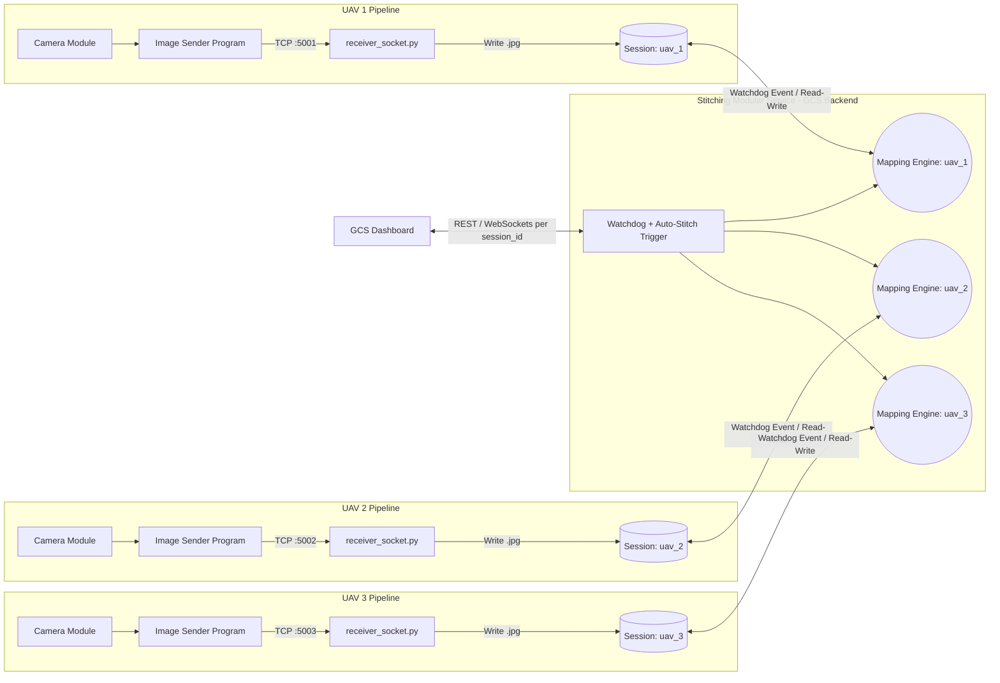

# Multi-UAV System Architecture

Extends the single-UAV architecture in [SYSTEM.md](./SYSTEM.md) to concurrent multi-UAV ingestion. Renamed components:

| Old name (SYSTEM.md) | New name |
|---|---|
| Core Engine: `Combiner.py` | **Mapping Engine** |
| `service.py` FastAPI | **Stitching Modular Service** |
| Session Directory | **Session** (monitors intermediate stitching results) |

## Notes

- Each UAV keeps its own TCP port, `asyncio` connection handler, and isolated **Session** — one UAV's ingestion or stitching load never blocks another's (see [SOCKET.md](./SOCKET.md) for why `asyncio` replaced the old blocking `recvall` approach).
- **Mapping Engine** lives entirely on the GCS backend side, inside the **Stitching Modular Service** — it is not deployed on the UAV. The service's Watchdog + auto-stitch trigger dispatches one Mapping Engine instance per session; the Mapping Engine itself is a backend component invoked by the service, not a standalone microservice.
- The GCS Dashboard multiplexes over `session_id` (`uav_1`, `uav_2`, `uav_3`) against the same REST/WebSocket surface described in [TECHNICAL.md](./TECHNICAL.md#6-api-reference-servicepy).
- Cross-UAV mosaic merging (combining corridor strips into one map) is still not implemented — each Mapping Engine instance stitches its own session independently, per the limitation noted in TECHNICAL.md §10.5.
