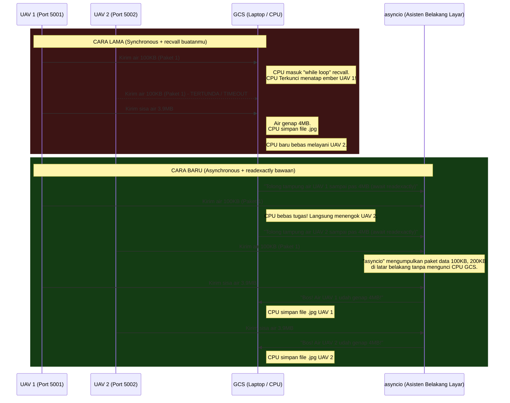

# Overview of socket connection between Ground Station and multi UAV

```mermaid
sequenceDiagram
    participant U1 as UAV 1 (Port 5001)
    participant U2 as UAV 2 (Port 5002)
    participant G as GCS (Laptop / CPU)
    participant EL as asyncio (Asisten Belakang Layar)

    rect rgb(60, 20, 20)
    Note over U1, G: CARA LAMA (Synchronous + recvall buatanmu)
    U1->>G: Kirim air 100KB (Paket 1)
    Note right of G: CPU masuk "while loop" recvall.<br/>CPU Terkunci menatap ember UAV 1!
    U2--xG: Kirim air 100KB (Paket 1) - TERTUNDA / TIMEOUT
    U1->>G: Kirim sisa air 3.9MB
    Note right of G: Air genap 4MB.<br/>CPU simpan file .jpg
    Note right of G: CPU baru bebas melayani UAV 2.
    end

    rect rgb(20, 60, 20)
    Note over U1, EL: CARA BARU (Asynchronous + readexactly bawaan)
    G->>EL: "Tolong tampung air UAV 1 sampai pas 4MB (await readexactly)"
    U1->>EL: Kirim air 100KB (Paket 1)
    Note right of G: CPU bebas tugas! Langsung menengok UAV 2.
    G->>EL: "Tolong tampung air UAV 2 sampai pas 4MB (await readexactly)"
    U2->>EL: Kirim air 100KB (Paket 1)
    
    Note over EL: "asyncio" mengumpulkan paket data 100KB, 200KB<br/>di latar belakang tanpa mengunci CPU GCS.
    
    U1->>EL: Kirim sisa air 3.9MB
    EL->>G: "Bos! Air UAV 1 udah genap 4MB!"
    Note right of G: CPU simpan file .jpg UAV 1
    
    U2->>EL: Kirim sisa air 3.9MB
    EL->>G: "Bos! Air UAV 2 udah genap 4MB!"
    Note right of G: CPU simpan file .jpg UAV 2
    end
```