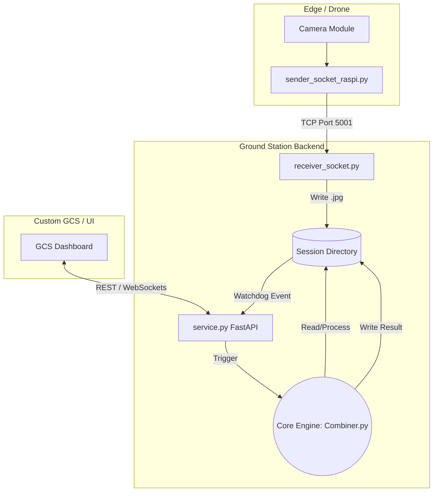

# VISION-LIVESTITCH: Near Real-Time Image Stitching Architecture

## 1. Overview
This document outlines the architecture, data flow, and core algorithms of the **Vision-LiveStitch** project. The goal of this system is to dynamically stitch incoming frames from a drone or Raspberry Pi node into a continuous orthomosaic in *near real-time*. 

As you prepare to integrate this pipeline into the custom Ground Control Station (GCS), this guide will serve as your blueprint for understanding how the microservices communicate and how the core mathematical engines work.

---

## 2. System Architecture

The pipeline operates across discrete microservices connected via TCP Sockets, File System bindings (Watchdog), and HTTP/WebSockets. 



### 2.1. Sender Node (sender_socket_raspi.py)
Runs on the companion computer (e.g., Raspberry Pi). It captures frames using OpenCV, encodes them to JPEG, attaches a 4-byte big-endian header indicating the payload length, and streams them out via a TCP socket.

### 2.2. Receiver Node (receiver_socket.py)
Listens on a designated port (default `5001`). It decodes the incoming byte stream, reading the exact length of the image payload based on the header. It sequentially saves the frames into isolated session folders (e.g., images).

### 2.3. Live Stitching Microservice (service.py)
A FastAPI backend that acts as the bridge between the raw file saving and the heavy image processing.
* **Watchdog Monitoring:** Monitors the session directories. When a file is confirmed stable on the disk, it registers the new frame.
* **Auto-Stitch Trigger:** Based on a configurable threshold (e.g., every 5 images), a background thread is spawned to trigger the core stitching engine without blocking the web server.
* **GCS Integration Points:** Exposes WebSockets (`/ws/{session_id}`) to push real-time status, file detection events, and stitching completion flags to the GCS front-end. Returns intermediate results via REST.

---

## 3. Core Stitching Engine (`Combiner.py`)

The pipeline in `Combiner.py` deviates from traditional "batch" stitching (where all images are optimized at once) to prioritize speed and continuous addition mapping.

### 3.1. Adaptive ROI Prediction
Instead of running feature detection (SIFT) over the entire newly arrived 4K/1080p frame, the system predicts exactly where the new frame overlaps with the existing mosaic.
* **Mechanism:** It uses the inverse of the relative homography from the *previous* step (`H_rel_prev`). By projecting the new image corners through this transformation (with a ~15% padding margin), it bounds a localized Region of Interest (ROI).
* **Benefits:** Drastically reduces the keypoint search space, cutting down computational time and minimizing false-matching with repetitive backgrounds. Keypoints are subsequently re-mapped to global coordinates.

### 3.2. Chained Matrix Multiplication (Homography)
Unlike standard panorama stitchers that perform global bundle adjustment, this system maps images purely sequentially. 
* **Mechanism:** The algorithm estimates a relative transformation (Affine -> fallback to Perspective/Homography) between `Image(N-1)` and `Image(N)`. 
* **The Math:** The global position of the new image is calculated by multiplying the new relative matrix against the previously accumulated global matrix:
  $$ H_{global\_current} = H_{global\_prev} \times H_{rel} $$
  The matrix is then normalized: `H[current] = H[current] / H[current][2,2]`.

### 3.3. Localized Feather Blending (`ROIfeatherBlender.py`)
Alpha blending large 4K canvases is critically expensive. We solve this using a localized approach.
* **Mechanism:** 
  1. The system finds the bounding box of the exact overlapping pixels between the accumulated mosaic and the newly warped frame.
  2. It crops both canvases to this bounding box.
  3. A Euclidean Distance Transform is applied on both masks.
  4. The alpha map is calculated inside this small ROI: $\alpha = \frac{d_1}{d_1 + d_2}$ (cubed for smoother transitions).
  5. The blended patch is pasted back into the main canvas.
* **Benefits:** Avoids iterating over millions of empty black pixels, resulting in O(Overlap Area) complexity rather than O(Canvas Area).

---

## 4. Next Steps & R&D Integration for GCS

To the colleague continuing this development, here are the direct areas of focus to prepare this for the full GCS integration:

1. **Drift Management (Crucial)**
   * *The Problem:* Because we use **chained matrix multiplication**, small homography estimation errors will accumulate. After 100 images, the frame might begin to warp severely or drift off-axis.
   * *R&D Task:* Since the metadata ingestion structure is already present (converting lat/lon to local X,Y,Z in `ImageMosaic.py`), you need to synchronize the RasPi telemetry output with the socket stream. By injecting GPS/IMU data as a prior, you can enforce rigid constraints on the homography matrix to arrest drift.

2. **Telemetry multiplexing**
   * Currently, the Raspberry Pi sender only sends raw image bytes. You will need to upgrade sender_socket_raspi.py and receiver_socket.py to send a structured payload (e.g., JSON header + Image bytes) containing the Drone's pose/GPS at the exact capture millisecond.

3. **GCS Frontend Coupling**
   * Review the WebSockets exposed in service.py. Your GCS UI should connect to `ws://127.0.0.1:8001/ws/session_1`. 
   * When the WebSocket emits `{"type": "stitching_completed"}`, your GCS map widget should trigger an HTTP GET to `/session/session_1/intermediates` or `/result` and seamlessly update the map overlay.

## 5. Quick Start for Testing

To run the full stack locally:
```bash
# Start the backend and receiver in parallel
chmod +x LIVE_STITCHING_START.sh
./LIVE_STITCHING_START.sh session_test_01

# On the Raspberry Pi / Drone
python sender_socket_raspi.py
```