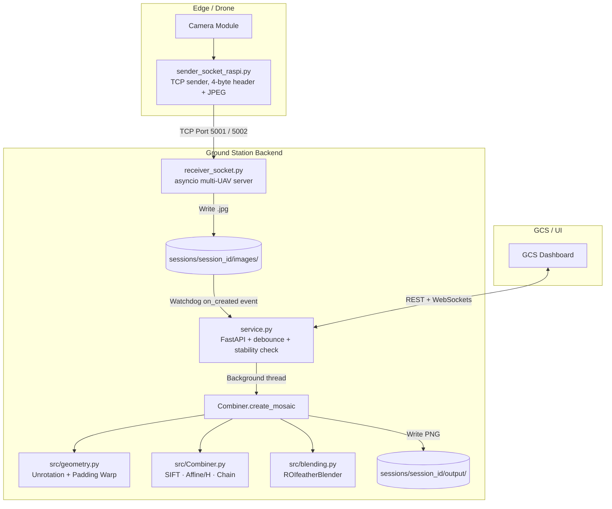

# VISION-LIVESTITCH — Technical Reference Document

> **Project**: VISION-LIVESTITCH
> **Purpose**: Near real-time, image-only aerial orthomosaic stitching pipeline for drone-to-GCS corridor mapping
> **Primary Language**: Python 3
> **Core Dependencies**: OpenCV, NumPy, FastAPI, asyncio, Watchdog

---

## Table of Contents

1. [Project Overview](#1-project-overview)
2. [System Architecture](#2-system-architecture)
3. [Module Reference](#3-module-reference)
   - 3.1 [receiver_socket.py — Image Ingestion Layer](#31-receiver_socketpy--image-ingestion-layer)
   - 3.2 [service.py — Orchestration & API Layer](#32-servicepy--orchestration--api-layer)
   - 3.3 [src/Combiner.py — Core Stitching Engine](#33-srccombinerpy--core-stitching-engine)
   - 3.4 [src/blending.py — Blending Strategies](#34-srcblendingpy--blending-strategies)
   - 3.5 [src/geometry.py — Geometric Utilities](#35-srcgeometrypy--geometric-utilities)
   - 3.6 [src/utilities.py — Data I/O & GPS Utilities](#36-srcutilitiespy--data-io--gps-utilities)
4. [Core Algorithms — Deep Dive](#4-core-algorithms--deep-dive)
   - 4.1 [Adaptive ROI Prediction](#41-adaptive-roi-prediction)
   - 4.2 [Feature Detection & Matching (SIFT + BFMatcher)](#42-feature-detection--matching-sift--bfmatcher)
   - 4.3 [Transform Estimation: Affine → Homography Fallback](#43-transform-estimation-affine--homography-fallback)
   - 4.4 [Chained Matrix Accumulation](#44-chained-matrix-accumulation)
   - 4.5 [Localized Feather Blending (ROIfeatherBlender)](#45-localized-feather-blending-roifeatherblender)
5. [Data Flow — End to End](#5-data-flow--end-to-end)
6. [API Reference](#6-api-reference-servicepy)
7. [Socket Protocol Specification](#7-socket-protocol-specification)
8. [Session & Directory Structure](#8-session--directory-structure)
9. [Configuration & Tunable Parameters](#9-configuration--tunable-parameters)
10. [Known Limitations & R&D Notes](#10-known-limitations--rd-notes)

---

## 1. Project Overview

VISION-LIVESTITCH is a **sequential, frame-to-frame aerial image stitching pipeline** built for real-time orthomosaic generation. Its primary use case is **corridor mapping** — building a continuous 2D top-down mosaic as a drone traverses a path — without relying on heavy global optimization techniques such as bundle adjustment.

### Design Philosophy

| Principle | Implementation |
|---|---|
| **Speed over global accuracy** | Chained matrix multiplication (no bundle adjustment) |
| **Minimal memory footprint** | Localized blending — O(overlap) not O(canvas) |
| **Resilient feature matching** | Adaptive ROI prediction to narrow keypoint search space |
| **Microservices-ready** | FastAPI backend, WebSocket push, async socket receiver |
| **Graceful degradation** | Affine to Homography fallback; ROI to full-frame fallback |

---

## 2. System Architecture



### Component Roles

| Component | File | Role |
|---|---|---|
| **Image Ingestion** | `receiver_socket.py` | Async TCP server; reads 4-byte header + JPEG payload; saves to disk |
| **Orchestration** | `service.py` | FastAPI; Watchdog monitoring; session management; WS push; REST API |
| **Stitching Engine** | `src/Combiner.py` | Sequential mosaic construction via SIFT + Affine/Homography + ROI feather blend |
| **Blending** | `src/blending.py` | Multiple blending strategies (ROI feather, pyramid, hybrid, incremental) |
| **Geometry** | `src/geometry.py` | IMU-based unrotation matrix; perspective warp with boundary padding |
| **Data I/O** | `src/utilities.py` | Image loading; EXIF GPS extraction; GPS redundancy filtering |
| **Entry Point (batch)** | `src/ImageMosaic.py` | CLI driver for batch offline stitching |

---

## 3. Module Reference

### 3.1 `receiver_socket.py` — Image Ingestion Layer

An `asyncio`-based TCP server designed for **concurrent multi-UAV image reception**.

#### Configuration

```python
UAV_CONFIG = {
    "uav1": {"port": 5001, "session_id": "uav_1"},
    "uav2": {"port": 5002, "session_id": "uav_2"},
}
```

Each UAV maps to a dedicated port and a session directory. New UAVs can be added by extending `UAV_CONFIG`.

#### Wire Protocol

```
+-------------------------------+---------------------------+
|  4 bytes (big-endian uint32)  |    N bytes (JPEG data)    |
|       Payload Length          |     Raw Image Bytes       |
+-------------------------------+---------------------------+
```

- **Header**: `struct.pack("!I", length)` — 4-byte big-endian unsigned integer.
- **Payload**: Raw JPEG-encoded image bytes of exactly `length` bytes.
- **Read**: Uses `asyncio.StreamReader.readexactly()` for guaranteed exact-length reads (non-blocking).

#### Async Connection Handler

```python
async def handle_uavs_connections(reader, writer, session_id, save_dir)
```

Per-connection coroutine. Reads header then reads payload then saves as `{timestamp}_{counter:04d}.jpg`.

#### Why asyncio?

The old synchronous `recvall` implementation blocked the CPU per-connection. `asyncio` with `readexactly` allows the event loop to interleave packet reading for multiple UAVs concurrently without threads.

---

### 3.2 `service.py` — Orchestration & API Layer

A **FastAPI** application serving as the central broker between image storage, the stitching engine, and the GCS frontend.

#### Key Classes

**`StitchConfig` (Pydantic Model)**

```python
sessionId: str
auto_stitch_threshold: int = 5    # Trigger stitch every N new images
auto_stitch_enabled: bool = False
folder_monitoring_enabled: bool = False
output_name: str = "finalResult.png"
```

**`StitchingSession`** — Runtime state holder per session:

- `image_folder`: `sessions/{id}/images/`
- `output_folder`: `sessions/{id}/output/`
- `image_count`: Live count of received images
- `is_stitching`: Mutex-like boolean to prevent concurrent stitching
- `ws_clients`: List of connected WebSocket clients

**`SessionFolderHandler` (Watchdog)** — `FileSystemEventHandler` subclass with two guards:

1. **Debounce** (`debounce_s=1.0s`): Ignores repeated events for the same path within the window.
2. **Stability check** (`stable_wait=0.5s x 6 tries`): Polls file size until it stops growing, ensuring the write is complete before processing.

#### Startup Behavior

On boot, `discover_existing_sessions()` scans `./sessions/` and auto-registers any pre-existing session folders into memory.

---

### 3.3 `src/Combiner.py` — Core Stitching Engine

The `Combiner` class orchestrates the complete sequential mosaic construction.

#### Constructor

```python
Combiner(imageList_, dataMatrix_, output="output")
```

| Param | Type | Description |
|---|---|---|
| `imageList_` | `List[np.ndarray]` | Raw input images (BGR) |
| `dataMatrix_` | `np.ndarray (Nx6)` | Pose data `[X, Y, Z, Yaw, Pitch, Roll]` per image |
| `output` | `str` | Output directory path |

On construction, all images are immediately **preprocessed** (downsampled + unrotated).

#### Internal State

| Attribute | Purpose |
|---|---|
| `H_global_prev` | Accumulated global homography (3x3), starts as identity |
| `H_rel_prev` | Relative homography from the previous step (used for ROI prediction) |
| `result_image` | The running mosaic canvas (starts as image[0]) |
| `timing_stats` | Dict of cumulative time per pipeline stage |

#### Pipeline per `combine(index)` Call

```
image[index-1] (reference) --+
                              +--> SIFT feature detection
image[index] (incoming)  --+-+
  [ROI-cropped if H_rel_prev exists]
                              |
                              v
                        BFMatcher (k=2, ratio=0.55)
                              |
                              v
                  estimateAffinePartial2D --(fail)--> findHomography (RANSAC)
                              |
                              v
                   H_global = H_global_prev x H_rel   (chained accumulation)
                   H_global = H_global / H_global[2,2] (normalization)
                              |
                              v
                  Compute canvas bounds --> warpPerspective both images
                              |
                              v
                      ROIfeatherBlender._roi_feather_blend()
                              |
                              v
                   result_image updated --> intermediate PNG saved
                   H_global_prev updated with translation offset
```

#### `create_mosaic()`

Iterates `combine(i)` for `i = 1 to N-1` and returns the final `result_image`. Prints and saves a timing summary to `timing_stats.txt`.

---

### 3.4 `src/blending.py` — Blending Strategies

Multiple blending classes are implemented. The **active** one in the pipeline is `ROIfeatherBlender`.

#### `ROIfeatherBlender` — Active

```python
ROIfeatherBlender._roi_feather_blend(warped_result, warped_img2) -> np.ndarray
```

**Algorithm:**

1. Threshold both warped images to binary masks (pixels > 1).
2. Compute `overlap_mask = mask1 AND mask2`.
3. For non-overlapping pixels of `img2`, copy them directly into `result`.
4. Bounding-box the overlap region.
5. Inside the bounding box, run `cv2.distanceTransform` on both masks.
6. Compute alpha: `a = (d1 / (d1 + d2 + eps))^3` — cubed for smoother transition.
7. Alpha-blend only inside the overlap bounding box; paste back.

**Complexity**: O(overlap area) — not O(canvas area).

#### `PyramidBlender`

Full Laplacian pyramid blending with Gaussian mask smoothing. Available as `blend_images()`, `blend_images_roi()`, `blend_images_lowres()`. Currently unused in the live pipeline but present as an upgrade path.

#### `hybridBlender`

Adaptive: uses simple feather blend inside the overlap ROI in `fast_mode=True`, falls back to full pyramid blending otherwise.

#### `AdaptiveWeightedFusion` / `incrementalFusion`

Experimental classes for Gaussian center-weighted and winner-take-all incremental fusion strategies. Not yet integrated into the main pipeline.

---

### 3.5 `src/geometry.py` — Geometric Utilities

#### `computeUnRotMatrix(pose)`

Computes the **inverse rotation matrix** from a `[X, Y, Z, Yaw, Pitch, Roll]` pose vector.

```
R = Rz(yaw) x Ry(pitch) x Rx(roll)
R[0,2] = R[1,2] = 0;  R[2,2] = 1   <- enforce planar projection
InvR = (R^T)^-1
```

Applied during preprocessing to remove tilt distortion. If IMU data is unavailable, pose is all zeros → `InvR` becomes identity (no correction).

#### `warpPerspectiveWithPadding(image, transformation)`

Standard `cv2.warpPerspective` but **auto-expands the canvas** to fit all warped corners. Projects the 4 original corners through the transformation, computes min/max bounds, then prepends a translation to shift everything into positive coordinate space.

---

### 3.6 `src/utilities.py` — Data I/O & GPS Utilities

#### Image Loading

```python
importData(imageDirectory, return_as_dict=False)
-> (List[np.ndarray], List[dict | tuple])
```

Sorted directory scan. Reads images via `cv2.imread`. Extracts EXIF GPS metadata per image using `exifread`. Returns images + metadata list in matched order.

#### GPS Extraction

| Function | Library | Output |
|---|---|---|
| `extract_gps_data(path)` | `exifread` | `{latitude, longitude, altitude}` dict |
| `extract_gps_data_PIL(path)` | `Pillow` | Same format (legacy alternative) |
| `extract_gps_data_tuple(path)` | `exifread` | `(lat, lon, alt)` tuple |

DMS to Decimal Degrees conversion:

```
DD = degrees + minutes/60 + seconds/3600
```

Sign adjusted by Lat/Lon reference (N/S, E/W).

#### GPS Redundancy Filter

```python
redundancy_filter(gps_data_list, threshold=1.0)
-> Set[int]  # indices of redundant images
```

O(N^2) pairwise geodesic distance check using `geopy.distance.geodesic`. Images within `threshold` meters of an earlier image are flagged as redundant.

---

## 4. Core Algorithms — Deep Dive

### 4.1 Adaptive ROI Prediction

**Problem**: Running SIFT on a full 4K frame is expensive. Most of the frame has no overlap with the previous mosaic.

**Mechanism**: The system inverts the **previous relative homography** `H_rel_prev` and projects the corners of the incoming image through it to estimate where the previous frame's footprint maps in the new image's coordinate space.

```python
H_inv = inv(H_rel_prev)
warped_corners = perspectiveTransform(image_corners, H_inv)
ROI = bounding_box(warped_corners) + 15% padding margin
```

**Fallback**: If the resulting ROI is smaller than 100x100 pixels, the entire frame is used.

**Keypoint Re-mapping**: After detecting keypoints inside the ROI, each coordinate is offset by `(x_start, y_start)` to re-project them back into the full image's coordinate space before matching.

---

### 4.2 Feature Detection & Matching (SIFT + BFMatcher)

**Detector**: `cv2.SIFT_create(1800)` — up to 1800 keypoints per image.
**Mask**: Binary mask (threshold > 1) to exclude pure-black padded areas from keypoint detection.

**Matcher**: `cv2.BFMatcher()` with `knnMatch(k=2)`.

**Ratio Test** (Lowe's criterion):

```python
good = [m for m, n in matches if m.distance < 0.55 * n.distance]
```

A ratio threshold of `0.55` is more aggressive than Lowe's standard `0.75`, reducing false positives at the cost of fewer total matches. Minimum of **4 good matches** required to proceed.

---

### 4.3 Transform Estimation: Affine → Homography Fallback

```python
A, _ = cv2.estimateAffinePartial2D(src_pts, dst_pts)
if A is None:
    H, _ = cv2.findHomography(src_pts, dst_pts, method=cv2.RANSAC)
```

**Affine (preferred)**: Encodes translation, rotation, and uniform scale (4 DoF). Faster, more stable, no perspective distortion.

**Homography (fallback)**: Full 8 DoF perspective transform. More flexible but more prone to degenerate solutions on near-planar scenes.

The affine matrix `A` (2x3) is promoted to a 3x3 matrix for chaining:

```python
H_rel_3x3 = np.vstack([A, [0, 0, 1]])
```

---

### 4.4 Chained Matrix Accumulation

Rather than solving a global optimization problem, the pipeline maintains a running **global homography** that maps any new image directly into the mosaic's coordinate frame.

```
H_global_current = H_global_prev x H_rel
H_global_current = H_global_current / H_global_current[2,2]   <- normalize
```

After warping and blending, the global homography is updated to include the translation offset from canvas expansion:

```
H_global_prev_new = T_translation x H_global_current
```

> [!WARNING]
> **Drift**: Because errors in each `H_rel` accumulate multiplicatively, small per-frame estimation errors compound over time. After ~50–100 images, the mosaic may exhibit noticeable warp or offset drift. GPS/IMU prior injection is the prescribed mitigation (see §10).

---

### 4.5 Localized Feather Blending (ROIfeatherBlender)

**Full Algorithm**:

```
1.  mask1 = warped_result > 1  (binary)
    mask2 = warped_img2 > 1    (binary)
    overlap = mask1 AND mask2

2.  only_img2 = mask2 AND NOT mask1
    result[only_img2] = img2[only_img2]       <- direct copy for non-overlapping pixels

3.  bbox = boundingRect(overlap)              <- localize work to overlap zone

4.  dist1 = distanceTransform(mask1 in bbox) <- distance from img1's edge
    dist2 = distanceTransform(mask2 in bbox) <- distance from img2's edge

5.  alpha = (dist1 / (dist1 + dist2 + eps))^3  <- cubic for smooth transition

6.  blended = alpha * img1 + (1-alpha) * img2   <- alpha composite in overlap only

7.  result[bbox][overlap] = blended
```

The **cubic exponent** on alpha steepens the gradient near each image's boundary, producing a sharper but still smooth transition compared to linear alpha.

---

## 5. Data Flow — End to End

```
[Drone]
  |
  |  JPEG frame captured by camera
  |  Encoded: struct.pack("!I", len) + jpeg_bytes
  |
  +--> TCP Port 5001
  |
[receiver_socket.py]
  |  asyncio.start_server -> handle_uavs_connections
  |  reader.readexactly(4)  -> parse length
  |  reader.readexactly(N)  -> JPEG bytes
  |  Save: sessions/uav_1/images/{ts}_{n:04d}.jpg
  |
[service.py - Watchdog SessionFolderHandler]
  |  on_created triggered
  |  Debounce check (1.0s) + Stability check (file size stable)
  |  session.image_count updated
  |  WebSocket push: {"type": "file_detected", ...}
  |
  |  [if auto_stitch_enabled AND new_images >= threshold]
  |    +--> background thread: run_stitching(session_id)
  |
  |    OR manual trigger: POST /session/{id}/stitch
  |
[run_stitching]
  |  util.importData(sessions/uav_1/images/) -> allImages, gps_data
  |  Build dataMatrix (GPS -> local X,Y,Z; Yaw/Pitch/Roll = 0 if no IMU)
  |  Combiner(allImages, dataMatrix, output_dir)
  |
[Combiner.__preprocess_images]
  |  For each image:
  |    downsample (stride=5, i.e. 5x reduction)
  |    computeUnRotMatrix -> warpPerspectiveWithPadding
  |
[Combiner.create_mosaic -> combine(i) for i=1..N-1]
  |  ROI prediction (if H_rel_prev exists)
  |  SIFT detect on reference + ROI-cropped incoming
  |  Re-map keypoints to full image space
  |  BFMatcher + ratio test (0.55)
  |  estimateAffinePartial2D -> fallback findHomography
  |  H_global = H_global_prev x H_rel (chained)
  |  Compute canvas bounds -> warpPerspective both images
  |  ROIfeatherBlender._roi_feather_blend()
  |  Save intermediateResult_{i}.png
  |  Update H_global_prev
  |
[output]
  |  sessions/uav_1/output/finalResult.png
  |  sessions/uav_1/output/intermediateResult_{i}.png
  |  sessions/uav_1/output/matches/matches_{i-1}_{i}.jpg
  |  sessions/uav_1/output/timing_stats.txt
  |
[service.py WebSocket]
  +--> {"type": "stitching_completed", "output_file": "/session/uav_1/result"}

[GCS] GET /session/uav_1/result -> FileResponse(finalResult.png)
```

---

## 6. API Reference (`service.py`)

**Base URL**: `http://127.0.0.1:8001`

### REST Endpoints

| Method | Path | Description |
|---|---|---|
| `GET` | `/` | Service info + active session count |
| `GET` | `/sessions` | List all sessions with status |
| `POST` | `/session/create` | Create a new session (body: `StitchConfig`) |
| `POST` | `/session/{id}/toggle-monitoring` | Enable/disable Watchdog (`?enable=true/false`) |
| `POST` | `/session/{id}/toggle-auto-stitch` | Enable/disable auto-stitch (`?enable=true/false`) |
| `POST` | `/session/{id}/upload` | Upload image files to the session |
| `POST` | `/session/{id}/stitch` | Manually trigger stitching (background task) |
| `GET` | `/session/{id}/result` | Download final result image |
| `GET` | `/session/{id}/intermediates` | List all intermediate result filenames |
| `GET` | `/session/{id}/status` | Full session status JSON |

### WebSocket

**Endpoint**: `ws://127.0.0.1:8001/ws/{session_id}`

**Events pushed by server**:

```json
// File received
{ "type": "file_detected", "file": "20260630_120001_0001.jpg", "total_images": 12 }

// Stitch started
{ "type": "stitching_started", "image_count": 12 }

// Stitch done
{
  "type": "stitching_completed",
  "success": true,
  "elapsed_time": 34.7,
  "error_message": null,
  "output_file": "/session/uav_1/result"
}
```

---

## 7. Socket Protocol Specification

### Sender to Receiver Wire Format

```
Byte 0-3:  uint32, big-endian -- length of image payload in bytes
Byte 4-N:  raw JPEG bytes (N = length from header)
```

### Sender Reference (Raspberry Pi)

```python
data = cv2.imencode('.jpg', frame)[1].tobytes()
header = struct.pack("!I", len(data))
sock.sendall(header + data)
```

### Receiver Guarantees

- `readexactly(4)` ensures the 4-byte header is always fully read before parsing.
- `readexactly(length)` ensures the exact JPEG payload size is consumed per frame — no partial reads, no stream desync.
- Each connection is handled by an independent coroutine; one slow UAV does not block others.

---

## 8. Session & Directory Structure

```
sessions/
+-- {session_id}/
    +-- images/               <- incoming frames (written by receiver_socket.py)
    |   +-- 20260630_120001_0001.jpg
    |   +-- 20260630_120005_0002.jpg
    |   +-- ...
    +-- output/               <- stitching results (written by Combiner.py)
        +-- finalResult.png
        +-- intermediateResult_1.png
        +-- intermediateResult_2.png
        +-- ...
        +-- timing_stats.txt
        +-- matches/
            +-- matches_0_1.jpg
            +-- matches_1_2.jpg
            +-- ...
```

---

## 9. Configuration & Tunable Parameters

| Parameter | Location | Default | Effect |
|---|---|---|---|
| `auto_stitch_threshold` | `StitchConfig` | `5` | Images to accumulate before triggering auto-stitch |
| `debounce_s` | `SessionFolderHandler` | `1.0s` | Min time between Watchdog events for same file |
| `stable_wait x stable_tries` | `SessionFolderHandler` | `0.5s x 6` | File-stability polling (3s total max wait) |
| SIFT `nfeatures` | `Combiner.__detect_features` | `1800` | Max keypoints per image |
| Ratio test threshold | `Combiner.__match_features` | `0.55` | Lower = stricter matching, fewer matches |
| Downsample stride | `Combiner.__preprocess_images` | `5` (5x) | `img[::5,::5]` — reduces resolution 5x each axis |
| ROI padding margin | `Combiner.__predict_roi` | `15%` | Extra margin around predicted overlap region |
| ROI fallback size | `Combiner.__predict_roi` | `100 px` | Use full image if predicted ROI is smaller than this |
| Alpha blending exponent | `ROIfeatherBlender` | `3` (cubic) | Higher = sharper blend boundary |
| UAV port mapping | `receiver_socket.py` | `5001, 5002` | Port per UAV; extend `UAV_CONFIG` to add more |

---

## 10. Known Limitations & R&D Notes

### 10.1 Drift Accumulation

**Root cause**: Each `H_rel` carries small estimation errors. Chained multiplication (`H_global = H_global_prev x H_rel`) means these errors are additive in log space and compound over the image sequence.

**Observable symptom**: After ~50–100 images, frame boundaries may appear skewed or the mosaic may diverge from the true ground footprint.

**Mitigation path**:

- Inject GPS/IMU as a homography prior: use geodesic distance between consecutive GPS positions to estimate expected translation, then apply it as a constraint on `H_rel` estimation.
- Implement periodic **keyframe re-anchoring**: every K frames, match the new frame against a keyframe rather than the immediate predecessor.

### 10.2 Image-Only Mode (Current State)

The current corridor mapping mode operates **without telemetry**. The `dataMatrix` is populated with zeros for Yaw/Pitch/Roll, and `computeUnRotMatrix` returns identity. This means:

- No geometric correction for drone tilt.
- Stitching relies entirely on visual feature matching for orientation inference.
- Works well for nadir (straight-down) shots with low roll/pitch.

### 10.3 Telemetry Multiplexing (Future Work)

To enable IMU-aided stitching, the socket protocol must be upgraded from raw JPEG to a **structured payload**:

```
[4-byte JSON header length][JSON metadata bytes][4-byte image length][JPEG bytes]
```

JSON metadata example:

```json
{
  "timestamp_ms": 1751288400000,
  "lat": -7.250445,
  "lon": 112.768845,
  "alt_m": 80.5,
  "yaw_deg": 15.2,
  "pitch_deg": -1.3,
  "roll_deg": 0.8
}
```

### 10.4 Performance Bottlenecks

Based on the timing instrumentation in `Combiner._print_timing_summary()`:

| Stage | Notes |
|---|---|
| **Preprocessing** | One-time cost; scales with N x image resolution |
| **Feature Detection** | Dominant per-frame cost; ROI prediction reduces this significantly after frame 1 |
| **Warping** | Scales with canvas size; grows as mosaic expands |
| **Blending** | Scales with overlap area (kept small by ROI approach) |

> [!TIP]
> The `[::5, ::5]` downsampling is the single largest quality-vs-speed lever. Reducing to `[::3, ::3]` improves output resolution at ~2.8x the memory and compute cost.

### 10.5 Multi-UAV Stitching

The receiver supports multiple UAVs (each on its own port/session). However, `service.py` stitches each session **independently**. Cross-UAV mosaic merging — stitching two corridor strips together — is not yet implemented.

---

*Document generated from source inspection of VISION-LIVESTITCH codebase.*
*Last updated: 2026-06-30*
